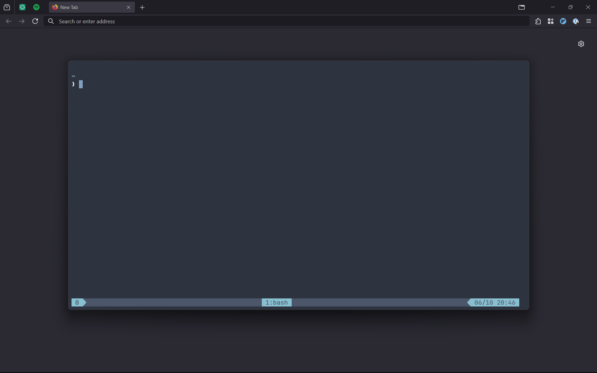

## Windows Configs

Automated Windows deployment using PowerShell Core.

Tested on Windows 11 Pro.



## Features:

- Nord-themed [Windows Terminal](https://github.com/microsoft/terminal)
- Fully configured Vim with plugins managed via [vim-plug](https://github.com/junegunn/vim-plug)

## Usage:

The below commands should all be executed from a PowerShell session with Administrator privileges:

```
winget install Microsoft.PowerShell Git.Git --accept-package-agreements --accept-source-agreements
New-Item -ErrorAction Ignore -Path $env:HOME\opt -ItemType Directory
& "C:\Program Files\Git\cmd\git.exe" clone https://github.com/heywoodlh/windows-configs.git $env:HOME\opt\windows-configs
```

### Gaming profile

If the gaming profile is desired then run these command:

```
Push-Location $env:HOME\opt\windows-configs
& "C:\Program Files\PowerShell\7\pwsh.exe" .\config.ps1 gaming
Pop-Location
```

### Dev profile

If the "dev" profile is desired then run these command:

```
Push-Location $env:HOME\opt\windows-configs
& "C:\Program Files\PowerShell\7\pwsh.exe" .\config.ps1 dev
Pop-Location
```


### Vim Plugins:

Launch `vim.exe` and the run the following command within Vim:

```
:PlugInstall
```

## WSL setup:

Run the following in WSL to configure it:

```
curl https://files.heywoodlh.io/scripts/linux.sh | bash -s -- workstation --ansible --home-manager
```
